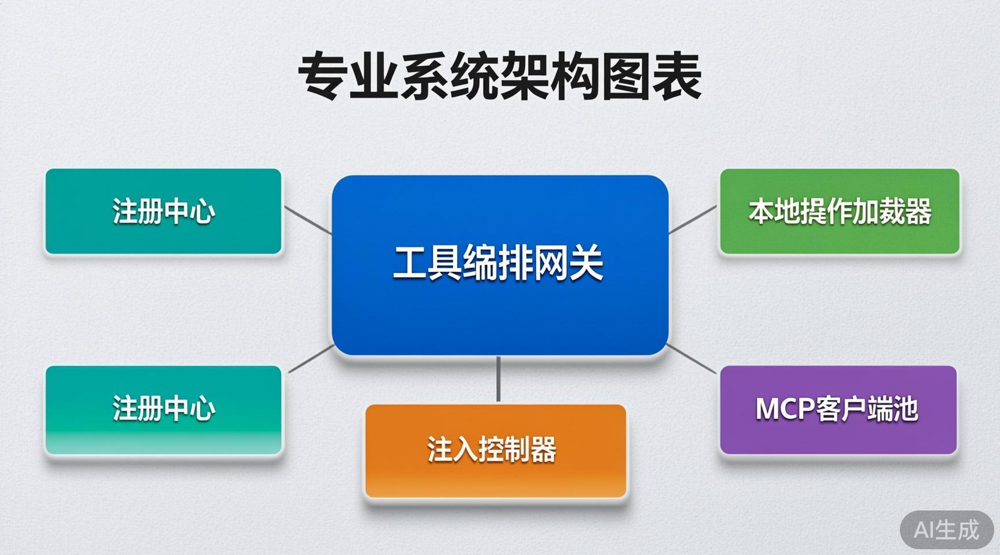

## 背景：为什么需要动态工具管理

假设你正在设计一个大型 Agent 系统。一开始只有 5 个工具，硬编码是自然的——写一个数组，模型调哪个你都知道。但当工具增长到 50 个、200 个时，两个问题会迫使你重新设计。

**第一个问题：运维成本。**

硬编码意味着每次新增工具都要：改代码 → 走 CI → 重启服务。在微服务架构里没有人能接受这种模式——为什么 Agent 的工具就要这么原始？

**第二个问题，更根本：LLM 的注意力不是无限的。**

当一个 Agent 有 200 个工具时，你不能把 200 个 Schema 都塞进上下文。Token 开销是一方面，更重要的是**选择困难**：工具越多，模型选错工具的概率越大。这是信息过载，不是模型能力问题。

所以动态管理的核心驱动力不是"做不做得到"，而是**大规模下必须解决这两个问题，否则系统不可扩展**。

---

## 顶层设计：三个正交维度

一个好的动态工具系统，本质上要在三个维度上做解耦：

| 维度 | 解决什么问题 |
|------|-------------|
| **注册**（工具怎么进来） | 新增工具不重启服务 |
| **发现**（工具状态怎么感知） | 运行时感知工具的增删和变更 |
| **注入**（工具怎么进 LLM 上下文） | 不把全部工具塞进一个 prompt |

三者正交——你可以只做注册不做注入（那注册了也没用），也可以只做注入不做注册（那就还得硬编码）。三个都做，才叫工业级。



*五个模块各司其职：Registry 管数据、Loader 管本地生命周期、MCP Pool 管远程生命周期、Orchestrator 管调用、Injector 管上下文筛选*

---

## 第一链路：本地 Local 工具

### 注册：选择"注解 + 目录扫描"而非"配置文件"

为什么选择注解+目录扫描？两个原因：

**理由一：解耦开发流程。**

如果用配置文件注册（YAML 里写 tools: [...]），新增工具需要改两个文件——工具本身 + 配置。这看起来只是多一步，但在多人协作的工程里，意味着代码审查、合并冲突、配置同步问题。如果用注解，开发者只新建一个文件，框架自动扫描注册，这是真正的"零侵入"。

**理由二：文件系统本身就是最好的"注册表"。**

文件存在 = 工具存在，文件删除 = 工具下线。不需要额外维护一份状态配置，用文件系统的事实状态作为真相来源。

伪代码的核心逻辑：

```python
# 启动时：扫描目录，加载所有 .py 文件
for py_file in plugin_root.rglob("*.py"):
    exec_module(py_file)  # 触发 @register_tool 装饰器 → 自动写入注册中心

# 运行时：watchdog 监听文件增删改
on_create(py_file)  → exec_module(py_file)
on_delete(py_file)  → registry.disable(py_file.tool_name)
on_modify(py_file)  → registry.replace(py_file.tool_name, new_meta)
```

### 发现：区分"启动发现"和"运行时发现"

- **启动发现**是静态的——扫描一遍目录，注册所有工具。简单，快。
- **运行时发现**是动态的——通过 watchdog 监听文件变更，实时同步注册表。

为什么需要区分？因为**启动发现**处理的是存量，**运行时发现**处理的是增量。存量用扫描（一次性成本），增量用监听（持续成本）。如果运行时也全量扫描，日志里会塞满噪音。

### 注入：四层策略的设计意图

注入是整个系统里最关键也最容易设计过度的部分。四层模式不是一次性想出来的，是从最简单的"全部注入"逐步演化的结果。

**模式 1：全局常驻**

意图：有一些工具确实是每次对话都要用的——获取时间、检查网络、简单的文本处理。这些工具放不放都很别扭：不放的话每个对话都要多一次调用去找它们，放的话它们占了上下文但大部分时候用不到。

权衡：只对调用频率极高、Schema 极轻的工具使用。数量不超过 3-5 个。

```python
# 初始化时，从注册中心筛选 core 分组的工具，永久挂载
self.global_fixed = [
    meta.schema for meta in registry.values()
    if meta.group == "core" and meta.enabled
]
```

**模式 2：意图驱动（核心模式）**

这是最主流的方案，也是设计工作量最大的。每一轮用户 query 进来后，先做意图分类，再匹配工具。

为什么不用关键词匹配就完了？因为工具的语义和用户 query 的语义不一定重叠。用户说"帮我查一下这个订单"，但工具名可能是 `tracking_info_lookup`。关键词匹配不到"订单"，但意图分类器应该能映射到。

意图分类器为什么不做成全量 LLM？——成本。每一次对话都调一次大模型做分类，Token 开销大、延迟高。

所以工业级的做法是**双阶段分类**：

```python
def classify(query: str) -> list[str]:
    # 阶段 1：正则（高速，毫秒级）
    for pattern, label in RULES:
        if re.search(pattern, query):
            return [label]

    # 阶段 2：小模型（兜底，几十毫秒）
    return bert_model.predict(query)
```

正则能匹配的直接返回，匹配不到的 fallback 到小模型。这样 95% 的情况都在 5ms 内完成。

```python
def inject_by_intent(self, query: str, role: str) -> list[dict]:
    tags = self.classifier.predict(query)
    tools = self.global_fixed.copy()
    for tag in tags:
        for name in self.registry.group_index.get(tag, []):
            meta = self.registry.get(name)
            if meta.enabled and role in meta.permission:
                tools.append(meta.schema)
    return tools[:15]  # 硬上限，防止分类器失误导致工具过多
```

**模式 3：权限过滤**

这不是功能，是安全基线。任何注入策略都必须附带权限校验——不仅仅是因为安全合规，更实际的原因是：没有权限过滤，你就无法在同一个 Agent 实例上服务不同角色的用户。

```python
# 注入前，校验用户角色是否在工具 permission 白名单内
if ctx["role"] not in meta.permission:
    continue  # 跳过该工具
```

**模式 4：会话手动指定**

多 Agent 场景下，父 Agent 知道子 Agent 需要什么工具，不需要意图识别。这种场景下"精确指定"比"猜测"更高效。

```python
# 上层编排层精确指定工具名，注入控制器精准取出
tools = [registry.get(name).schema for name in specified_names if name in registry]
```

### 为什么四层而不是一层？

因为**没有一种注入策略能覆盖所有场景**。全局常驻覆盖高频，意图驱动覆盖主流场景，权限过滤是安全兜底，手动指定覆盖编排场景。四层共存意味着每个场景都能找到最合适的方案，而不是用一把锤子砸所有钉子。

---

## 第二链路：MCP 远程工具

### 为什么需要单独一个 MCP 链路？

如果本地工具已经覆盖了所有场景，为什么还要 MCP？

答案在于**所有权边界**。

本地工具是 Agent 进程内的——你写代码、你部署、你控制。但真实业务中，大部分工具不属于 Agent 团队。订单查询工具属于订单团队，物流工具属于物流团队，支付工具属于支付团队。

你不能让每个业务团队都把工具写成 Python 文件放到 Agent 的插件目录里——这是耦合，也是安全灾难。

MCP 的核心价值不是"远程调用"，而是**组织边界隔离**。每个团队独立部署、独立运维自己的 MCP Server，Agent 只通过标准协议消费工具。

```
┌──────────────────────────────┐
│      Agent 进程              │
│  ┌────────────────────────┐  │
│  │  MCP Client Pool       │──┼──→ 订单团队的 MCP Server
│  │                        │──┼──→ 物流团队的 MCP Server
│  │                        │──┼──→ 支付团队的 MCP Server
│  └────────────────────────┘  │
└──────────────────────────────┘
```

### 动态注册：通过协议而非配置

MCP 的注册机制不同于本地工具的"文件扫描"。它基于协议：Client 在握手阶段调用 `list_tools`，Server 返回全部工具 Schema。

```python
# Client 启动时：连接每个配置的 Server，拉取工具列表
for server_id, conf in configs.items():
    client = await MCPClient(server_id, conf).connect()
    tools = await client.rpc_call("list_tools")
    for t in tools:
        registry.register(ToolMeta(
            name=f"{server_id}_{t['name']}",  # 用 server_id 做命名空间，避免跨服务重名
            schema=t["inputSchema"],
            source=f"mcp:{server_id}",
            group=conf["group"],
            permission=conf["permission"],
        ))
```

注意 `name` 的命名方式：`server_id + "_" + tool_name`。这不是随意设计的。不同 MCP Server 可能暴露同名工具（比如订单 Server 和退款 Server 都有 `query`），必须用命名空间隔离。

### 发现：三种机制的取舍

| 机制 | 成本 | 实时性 | 适用场景 |
|------|------|--------|---------|
| 心跳+重连 | 低 | 中等 | 检测服务崩溃和恢复 |
| 定时轮询 | 中 | 低（秒级） | 感知工具内部变更 |
| 配置热更新 | 低 | 高 | 新增/删除 Server 节点 |

为什么不只用一种？因为**每种机制覆盖一种故障模式**：
- 心跳保活解决"Server 挂了我不知道"
- 轮询解决"Server 没挂但工具列表变了"
- 配置热更解决"新增了一台 Server"

只做心跳不做轮询，Server 添加了新工具你得等重启才知道。只做轮询不做心跳，Server 挂了要等下一轮轮询（最多 60s）才能发现。

### 注入统一

MCP 工具注册后，和本地工具共享同一个 `AgentInjector`。注入层不需要区分工具来源——四种模式全部复用。唯一的区别在调用阶段：

```python
# ToolOrchestrator 路由
if meta.source.startswith("mcp:"):
    client = mcp_pool.get(server_id)
    return await client.rpc_call("call_tool", ...)
else:
    instance = meta.tool_cls()
    return instance.run(params)
```

这一行 `if` 是整个双链路设计的精髓——注册中心归一化后，上层业务无感知。

---

## 幻觉抑制的设计取舍

工具注入中的幻觉抑制，本质是**预防而非纠错**。一旦工具进了上下文，LLM 选了它就是选了它，你没法"事后撤回"。

所以所有抑制策略都在注入阶段完成：

| 策略 | 设计意图 |
|------|---------|
| 数量硬上限（≤15） | 不是限制工具，是限制选择的复杂度。15 是经验值——超过这个数，模型准确率开始下降 |
| 禁用过滤 | 紧急熔断通道。线上出问题直接标记 disabled，不需要重新部署 |
| 权限过滤 | 不是为了"安全"的抽象目标，而是为了让同一个 Agent 能服务不同角色的用户 |
| 描述约束 | 在 `description` 里写明"不可用于 XXX 场景"——从 prompt 层约束调用意愿 |
| 注入日志 | 不是为了调试，是为了**归因**。当模型调错工具时，你能回答"为什么这个工具当时在上下文中" |

---

## 思考与延伸：从 Tools 到 Skills

（本部分为用户补充思考）

> 这套架构是为了解决 tools 的使用问题。能不能迁移到 skills 层面？如何提高 skills 命中率？

从架构角度看，Tools 和 Skills 面对的困境是**同构的**：

| Tools | Skills | 共同本质 |
|-------|--------|---------|
| 全量 Schema 注入 → Token 爆炸 | 全量 Skill 列表注入 prompt | 候选集超过模型注意力范围 |
| 工具太多 → LLM 选错 | Skills 太多 → Agent 忽略 | 信息过载导致选择退化 |

同构问题应当用同构方案解决。"按需注入"不是 Tools 层的专属模式，而是 Agent 系统处理**大量可选项**时的通用范式。无论可选项是工具、技能、知识库文档还是 API 端点，当候选集超过有效注意力范围时，就需要一个前置分类层来缩小范围。

如果把这个思路投射到 Skills 管理上：

```
用户 query → 轻量分类器 → 只注入 Top-3/5 匹配 skills → 节省 80%+ prompt 空间
                ↓ (低置信度)
             退化为全量 skill 列表（兜底）
```

这和 Tools 的"意图驱动注入"是同一种架构模式。区别在于：Tools 的注入是 LLM 函数调用层面的，Skills 的注入是 Agent 行为引导层面的。

---

## 总结

从架构师的视角来看，这套系统的设计没有"创新"，只有**合理的权衡**：

- **注册**选注解+目录扫描而非配置 → 为了开发者体验和零侵入
- **发现**分启动扫描和运行时监听 → 为了区分存量和增量两种工作负载
- **注入**做四层而非一层 → 因为没有一种策略能覆盖所有场景
- **Local + MCP 双链路** → 为了组织边界隔离，而非技术层面的"分布式调用"
- **幻觉抑制在注入阶段做** → 因为预防成本远低于纠错

每个设计决策背后都有一个具体的工程约束在驱动。理解这些约束，比记住架构图更重要。
