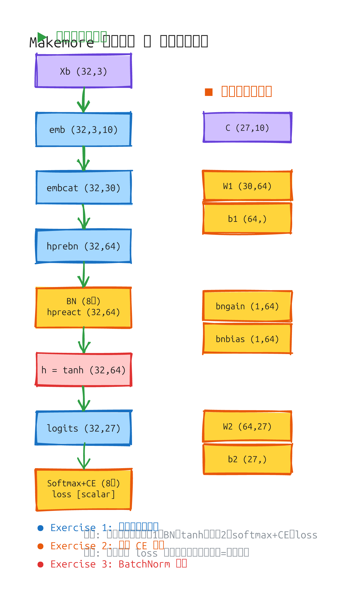
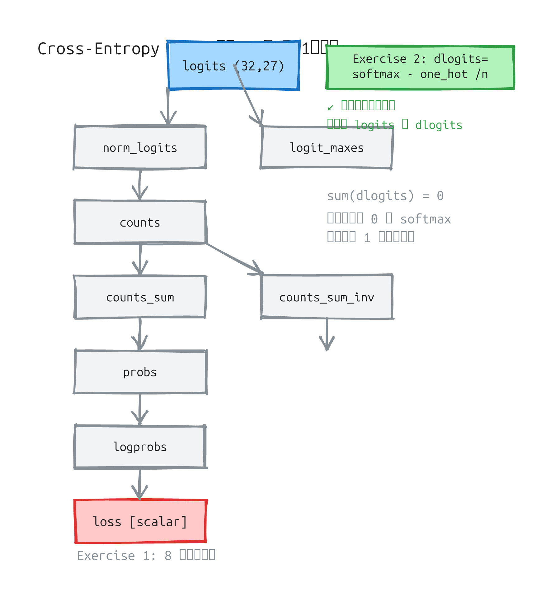
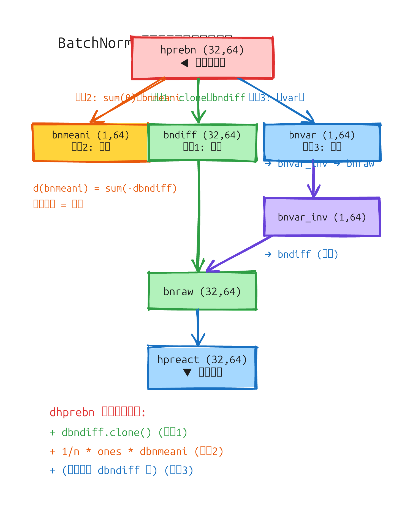

# Backprop Ninja：手动反向传播修炼指南

> 资料源：Andrej Karpathy "Building makemore Part 4: Becoming a Backprop Ninja"
> YouTube：https://www.youtube.com/watch?v=q8SA3rM6ckI
> Notebook：https://colab.research.google.com/drive/1WV2oi2fh9XXyldh02wupFQX0wh5ZC-z-

## 为什么手动做反向传播？

Karpathy 把反向传播称为 **"leaky abstraction"（有漏洞的抽象）**。

PyTorch 的 `loss.backward()` 让梯度计算变成了魔法——你搭好网络，调一下 API，梯度就自动出来了。看起来好像"堆砌可微分的乐高积木"就能工作，但现实是：

> "It will magically not work or not work optimally, and you will need to understand how it works under the hood if you're hoping to debug it."

当你遇到梯度爆炸、梯度消失、训练不收敛时，`loss.backward()` 不会告诉你哪里出了问题。你需要理解梯度是怎么流经计算图的。

这个视频（和之前的 micrograd）的核心理念：**理解 autograd 内部机制，才能有效调试和优化神经网络。**

## 先修知识

视频基于 Part 3 构建的 2 层 MLP（带 BatchNorm），用于字符级语言建模：

- **输入**：32 个样本，每样本 3 个字符（上下文长度）
- **词嵌入**：27 个字符 → 10 维向量
- **隐藏层**：30 维 → 64 个神经元
- **输出**：64 → 27（词汇表大小）

完整数据流如下图所示（前向从左到右，参数在右侧）：



这个网络我们之前用 `loss.backward()` 自动算梯度。现在我们要**关掉 autograd**，手写每一步的反向传播。

## Exercise 1：Cross-Entropy Loss 反向传播

### Softmax 的梯度

输出层是 softmax + 负对数似然。先回顾正向传播：

```python
# 正向
logits = h2                    # (32, 27)  batch=32, vocab=27
counts = logits.exp()          # 取指数
probs = counts / counts.sum(1, keepdim=True)  # 归一化 → 概率
loss = -probs[range(32), ys].log().mean()     # 交叉熵
```

反向传播需要计算 `dlogits`。这里有两个关键点：

**1. 广播（Broadcasting）**

`counts.sum(1, keepdim=True)` 的形状是 `(32, 1)`，而 `counts` 是 `(32, 27)`。PyTorch 会自动把 `(32, 1)` 广播到 `(32, 27)`——这意味着一行求和值被复制了 27 份。

反向传播时，广播的反向操作是 **sum**：梯度需要累加回被广播的维度。

**2. Softmax 梯度的简洁形式**

经过链式法则推导，cross-entropy + softmax 的反向传播可以简化为一个极其优雅的形式：

```python
dlogits = probs.copy()
dlogits[range(32), ys] -= 1    # 正确类别的概率减 1
dlogits /= 32                   # 除以 batch size（因为 loss 取了 mean）
```

下图展示了从 `logits` 到 `loss` 的 8 步正向操作，以及在 Exercise 2 中如何一步合并：



**直觉**：如果你的模型预测了 `[0.2, 0.5, 0.3]`，而正确答案是第二个类别（索引 1），那么梯度就是 `[0.2, -0.5, 0.3]`。负号告诉模型"提高这个类别的分数"，正号说"降低其他类别的分数"。

所有梯度之和为 0——这不是巧合，这是 softmax 输出概率和为 1 的必然结果。

## Exercise 2：线性层和 Tanh 的反向传播

### MatMul 反向传播

对于 `h = x @ W + b`，需要计算三个梯度：

```python
# 正向：h_preact = emb @ W1 + b1   形状： (32, 64) = (32, 30) @ (30, 64) + (64,)
# 反向：
dW1 = emb.T @ dh_preact   # (30, 64) = (30, 32) @ (32, 64)
demb = dh_preact @ W1.T   # (32, 30) = (32, 64) @ (64, 30)
db1 = dh_preact.sum(0)    # (64,) —— 广播的反向操作
```

**关键直觉**：矩阵乘法 $C = A @ B$，梯度是：
- $dA = dC @ B^T$ —— 误差从输出沿 B 的转置回流到 A
- $dB = A^T @ dC$ —— 误差从输出沿 A 的转置回流到 B

### Tanh 反向传播

Tanh 的导数是 $1 - \tanh(x)^2$：

```python
# 正向：h = tanh(h_preact)
# 反向：dh_preact = (1 - h²) * dh      # 逐元素相乘
```

这就是为什么 Tanh 激活容易梯度消失：当 `h` 接近 ±1 时，$1 - h^2$ 接近 0，梯度被"扼杀"。

### 嵌入层（Embedding）反向传播

嵌入表 `C` 是 `(27, 30)`（27 个字符，每个 30 维）。正向：从 `C` 中按索引查表。

反向：梯度的形状是 `(32, 3, 30)`（每个样本有 3 个字符，每个 30 维）。需要把梯度**累加**回嵌入表：

```python
dC = torch.zeros_like(C)  # (27, 30)
for k in range(32):
    for j in range(3):
        ix = Xb[k, j]
        dC[ix] += demb[k, j]
```

**注意**：如果多个样本索引到同一个嵌入向量，梯度要累加，不是覆盖。

## 插曲：BatchNorm 的 Bessel 校正

BatchNorm 的正向传播：

```python
mu = x.mean(0, keepdim=True)        # 列均值
sigma_sq = x.var(0, keepdim=True)   # 列方差
x_hat = (x - mu) / sigma_sq.sqrt()  # 归一化
y = gamma * x_hat + beta            # 缩放平移
```

Karpathy 指出一个常见的"小 bug"：PyTorch 的 `x.var()` 默认使用了 **Bessel's correction**（除以 $n-1$ 而非 $n$），用于无偏估计总体方差。

但在 BatchNorm 中这是**不正确的**——你希望归一化的是当前 batch 的方差，而不是总体的。除以 $n$ 得到的"有偏"估计才是正确的。

这个 bug 在实际中影响不大（batch size 大时，$n/(n-1) \approx 1$），但原理上值得理解。

## Exercise 3：BatchNorm 反向传播

这是视频中最复杂的部分。BatchNorm 的前向有 8 个原子步骤，反向需要从 `dhpreact` 逆推回 `dhprebn`。

难点在于 `hprebn` 出现在三条路径中：

1. **直接路径**：`hprebn → bndiff → bnraw → hpreact`
2. **均值路径**：`hprebn → bnmeani → bndiff → ... → hpreact`
3. **方差路径**：`hprebn → bnvar → bnvar_inv → bnraw → hpreact`

下图展示了这三条路径如何在 `dhprebn` 处汇合：



反向传播的推导分三步：

**第一步：dgamma 和 dbeta（最简单）**

```python
dbeta = dy.sum(0)              # (64,)
dgamma = (dy * x_hat).sum(0)   # (64,)
```

**第二步：dx_hat（中间步骤）**

```python
dx_hat = dy * gamma  # (32, 64)
```

**第三步：dx（三条路径累加）**

`x` 通过三条路径影响输出，最终的梯度公式为：

```python
N = x.shape[0]  # batch size
dx = (1.0 / N) * (1.0 / sigma_sq.sqrt()) * (
    N * dx_hat
    - dx_hat.sum(0)
    - x_hat * (dx_hat * x_hat).sum(0)
)
```

这个公式的三个项对应三条路径：
- **路径 1**（直接）：$N \cdot d\hat{x}$ —— 标准化后直接传递
- **路径 2**（通过 mu）：$-\sum d\hat{x}$ —— 减去均值影响
- **路径 3**（通过 var）：$-\hat{x} \cdot \sum (d\hat{x} \cdot \hat{x})$ —— 减去方差影响

> **直觉**：BatchNorm 的反向传播本质上是**从梯度中移除均值和方差的影响**，就像正向传播从数据中移除均值和方差一样。

## Exercise 4：整合验证

最后，把所有梯度填入参数更新，验证手动计算的梯度与 PyTorch autograd 的结果一致（数值容差内）。

```python
# 参数更新（SGD）
learning_rate = 0.1
for p, g in zip(parameters, grads):
    p.data -= learning_rate * g
```

Karpathy 的 notebook 验证了所有 26 个张量（包括中间变量）的梯度都 exact 或 approximate 匹配：

```
logprobs    | exact: True  | approximate: True  | maxdiff: 0.0
probs       | exact: True  | approximate: True  | maxdiff: 0.0
...
W2          | exact: True  | approximate: True  | maxdiff: 0.0
hprebn      | exact: True  | approximate: True  | maxdiff: 0.0
C           | exact: True  | approximate: True  | maxdiff: 0.0
```

## 总结

通过手动执行反向传播，你能获得三个关键洞察：

1. **广播的反向操作是 sum**——每次正向广播，反向都要求和。这是 PyTorch 中最容易被忽略的梯度规则
2. **Softmax + CrossEntropy 的梯度出奇地简洁**——$\text{softmax}(x) - \text{onehot}(y)$ 的形式背后隐藏了大量链式法则的推导
3. **BatchNorm 的反向传播是对梯度的"二次标准化"**——移除梯度中的均值和方差分量，就像正向移除数据中的均值和方差一样

Karpathy 的核心主张：**autograd 让你更高效，不理解它让你更脆弱。** 当你的神经网络表现异常时，知道梯度从哪里来、往哪里去，是调试的第一道防线。

### 四句话记住整个流程

| 操作 | 反向规则 |
|------|---------|
| `y = x @ W + b` | `dx = dy @ W.T`, `dW = x.T @ dy`, `db = dy.sum(0)` |
| `y = tanh(x)` | `dx = (1 - y²) * dy` |
| `y = softmax(x)` 后接 CE loss | `dx = (softmax - one_hot) / N` |
| 广播（如 `scaler * tensor`） | 对广播源求和 |
