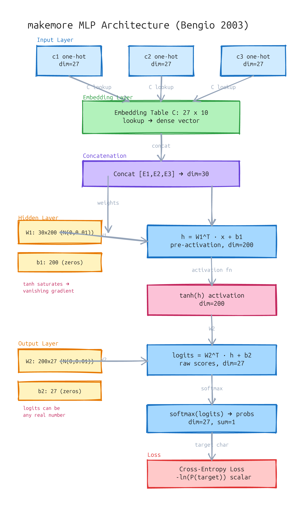

# makemore Part 3：激活函数、梯度消失与 Batch Normalization

> 资料源：Andrej Karpathy - Building makemore Part 3: Activations & Gradients, BatchNorm（2026-07-18）
> 前篇：[makemore Part 2：MLP 语言模型](/post/makemore-mlp/)

## Part 2 的遗留问题

Part 2 我们按照 Bengio 2003 的论文，实现了一个 MLP 字符级语言模型——输入几个历史字符的 embedding，拼接后过一层隐藏层（tanh），最后用 softmax 预测下一个字符。

当时我们初始化模型后直接开始训练，损失确实在下降，模型也确实在工作。但我们**没有检查的一件事**是：网络各层的激活值和梯度分布是什么样的？它们健康吗？

答案是：**大概率不健康**。这就是 Part 3 要解决的问题。

回顾一下 Part 2 的 MLP 架构：



**图：makemore MLP 架构。** 输入 3 个字符 → Embedding 表查稠密向量 → 拼接 → 隐藏层（线性变换 + tanh）→ 输出层（线性变换 + softmax）→ 交叉熵损失。

## 一个理想初始化的标准

当我们初始化一个神经网络时，我们希望**输出层的概率分布在训练初期接近 uniform**。对于字符级语言模型（27 个字符），这意味着 softmax 输出的每个类别的概率应该在 1/27 ≈ 3.7% 左右，对应的交叉熵损失应该是 `-ln(1/27) ≈ 3.3`。

如果初始损失远低于 3.3，说明模型一开始就"太自信"了，这通常意味着某些 logits 异常大；如果远高于 3.3，说明输出分布太分散。

但保持初始输出的均匀分布只是第一步。真正的问题是：**随着网络加深，激活值的分布会逐层漂移**。

## Tanh 饱和与梯度消失

Tanh 函数的值域是 (-1, 1)，它有一个关键特性：**当输入绝对值很大时（>2 或 <-2），tanh 进入饱和区，输出几乎不变，梯度趋近于 0**。

```
tanh(x) 的梯度 = 1 - tanh(x)²
当 x=0 时，梯度 = 1
当 x=2 时，梯度 ≈ 0.07
当 x=3 时，梯度 ≈ 0.01
当 x=5 时，梯度 ≈ 0.0002
```

问题出在**多层累积**上。假设你有一层线性变换 `h = Wx + b`，然后过 tanh。如果 W 的初始值太大，h 的方差会很大，导致 tanh 输入进入饱和区。这一层退化为"要么 1 要么 -1"的开关，梯度几乎为零。

更糟的是，梯度会随着层数**指数级衰减**：每一层把梯度缩小一点，N 层之后就消失了。这就是**梯度消失**——深层网络的经典问题。

> 梯度消失不是"训练变慢"，而是"底层几乎不再学习"。前面几层的权重基本不动，只有最后几层在变化。

### 权重初始化的改进

一个直接的思路：**控制权重初始化的大小，让各层激活值的方差保持稳定**。

Kaiming He 等人发现：对于使用 ReLU 的网络，权重应该从 `N(0, 2/fan_in)` 初始化；对于 tanh/Sigmoid，Xavier/Glorot 初始化建议用 `N(0, 1/fan_in)`。

为什么是 `1/fan_in`？考虑一个简单的线性层 `y = Wx`，其中 x 的均值为 0，方差为 1。W 有 fan_in 个输入。y 的方差大约是 `fan_in * Var(W)`。要 y 的方差保持为 1，需要 `Var(W) = 1/fan_in`。

用 Kaiming 初始化后，各层激活值的分布确实更稳定了——tanh 的输入不会一上来就飞到饱和区，梯度也能正常流通。

但 Kaiming 初始化不是银弹。它只是一个**静态的修补**——当你确定网络结构、深度、激活函数后，算一个合适的初始值。一旦网络深度变化、层类型变化（Linear → CNN → Attention），你得重新算。

有没有更动态、更通用的方案？

## Batch Normalization（2015）

Batch Normalization（BN）是 Google 在 2015 年提出的，一篇论文彻底改变了深层网络的训练方式。

### BN 的核心思想

每一层之前，显式地把激活值拉回到**均值为 0、方差为 1 的标准正态分布**，然后再送给下一层。

具体来说，对于一个 batch 的激活值 `x`（维度是 `batch_size × features`）：

```
μ_B = mean(x)               # batch 均值
σ²_B = var(x)               # batch 方差
x̂ = (x - μ_B) / √(σ²_B + ε)  # 归一化
y = γ * x̂ + β               # 缩放 + 平移（可学习）
```

关键设计：**归一化之后又加了一个可学习的缩放和平移**。为什么？

如果不加这一层，强制输出为 N(0,1) 可能限制了网络的表达能力——网络可能想学到一个非标准正态的分布。`γ` 和 `β` 给了网络"反悔"的能力：如果网络发现 N(0,1) 不好，可以学回原来的分布。

实际上，`γ` 初始化为 1，`β` 初始化为 0，所以 BN 一开始做的是纯归一化，然后网络在训练过程中慢慢调整 `γ` 和 `β`。

### BN 解决了什么问题？

1. **梯度消失**：tanh 的输入被拉到 0 附近，永远在 tanh 的线性区域工作（梯度最大），不会再进入饱和区。这使得我们可以训练更深的网络，**而不需要小心翼翼地调初始化**。

2. **对初始化不敏感**：有了 BN，用什么样的初始化差别不大。BN 会自动修正激活值的分布。

3. **允许更大的学习率**：激活值分布稳定 → 梯度分布稳定 → 可以用更大的学习率加速训练。

### BN 的正则化效果（副效应）

这是一个"意外收获"：**BN 有正则化效果**。

原因：每个样本在一个 batch 中的归一化依赖于同一 batch 中的其他样本。具体用哪些样本来算均值/方差，每个 epoch 都不同（因为 shuffle）。这相当于在训练过程中引入了噪声——同一个样本每次经过 BN 时的"语境"不同。

这种噪声让网络不容易过拟合到特定样本的精确特征。类似于 Dropout，但来源不同：

- **Dropout**：显式随机丢弃神经元
- **BN 的正则化**：隐式通过 batch 统计量的随机性引入

这也是为什么很多任务中，去掉 BN 后需要加 Dropout 或其他正则化手段才能维持同样的泛化性能。

### BN 的耦合问题

BN 有一个不易察觉的代价：**样本耦合**。

没有 BN 时，每个样本独立处理，batch 只是效率优化。有了 BN，算 mean/std 依赖整个 batch——样本 A 的输出耦合了样本 B、C、D。同一样本在不同 batch 里输出不同（因为"同桌"不同），梯度也变得耦合。

这就是为什么后来的人更倾向用 Layer Normalization（不做 batch 维度的归一化，只做特征维度的归一化，每个样本独立）。

### 训练 vs 推理：BN 的两副面孔

训练时，BN 使用**当前 batch 的均值/方差**。

推理时，没有 batch 的概念（可能一次只来一个样本），不能再用 batch 统计量。所以 BN 在训练过程中维护**running mean** 和 **running variance**——对所有 batch 的均值/方差做指数移动平均（EMA）。

推理时直接用 running 统计量，不再依赖 batch 大小。类比：训练时每次考试按这班同学的成绩来评分，推理时用过去一学期的平均分标准评分。

## 训练过程的健康检查

Karpathy 在代码中做了大量的**可视化**——这是理解网络是否在健康训练的核心手段：

**前向传播的激活值直方图**：

- 对每一层，在 forward 之后画出激活值的分布
- 健康的分布（钟形）：接近 N(0,1)，没有大片饱和区域
- 不健康的分布：集中在 ±1 附近（tanh 饱和），或者方差发散

**反向传播的梯度直方图**：

- 各层梯度应该在相似的尺度上
- 如果第一层的梯度比最后一层小 1000 倍，梯度消失了
- 如果第一层的梯度比最后一层大 1000 倍，梯度爆炸了

**调整 - 直方图变化 - 诊断的链条**：

1. 发现 W 太大 → 所有层激活值直方图两头高中间空（饱和）→ 梯度≈0
2. 把 W 乘 0.1 → 激活值缩回中间 → 钟形恢复 → 梯度开始流通
3. 加 BN → 所有层自动稳定 → 不需要手动试
4. 看梯度直方图 → 检查各层梯度是否同数量级

手动调 W → 看直方图 → 再调 → 再看... 这个试错循环就是 BN 和 Kaiming 初始化要替代的。

### 一个令人困惑的发现

在 MLP 中，**最后一层（输出层）的梯度往往比前面的隐藏层大几个数量级**。

原因：输出层直接连接着 softmax + 交叉熵损失。损失函数对输出层 logits 的梯度就是 `(softmax - target)`，这是一个直接的误差信号。而前面层的梯度需要经过多层 tanh 的链式法则，每一层放大或缩小梯度，最终传到前面的梯度被大幅衰减。

这说明：即使有了 BN，输出层和隐藏层之间的梯度尺度仍然不匹配。需要**对最后一层用更小的学习率**，或者给不同的层设置不同的学习率。

## 从 BN 到更多归一化层

BN 工作得很好，但它有一个局限：**依赖 batch 维度**。当 batch size 很小（比如 2 或 4）时，batch 统计量不稳定；当 batch size = 1 时（在线学习），BN 完全无法工作。

这引出了一系列后续工作：

- **Layer Normalization（LN）**：对每个样本的所有特征做归一化，不依赖 batch。Transformer 用的就是 LN
- **Instance Normalization（IN）**：对每个样本的每个通道做归一化。风格迁移常用
- **Group Normalization（GN）**：介于 LN 和 IN 之间，把特征分成几组做归一化。适用于 batch size 小的场景

> 一个有趣的历史事实：LN 比 BN 早几个月被提出，但 BN 的影响力远大于 LN，因为 BN 的论文把故事讲得更好——它抓住了"internal covariate shift"这个痛点。直到 Transformer 出现，LN 才重新被重视。

## 小结

Part 3 的核心教训是：**不要假设你的网络在健康地训练**。

三个层层递进的方案：

| 方案 | 思路 | 局限 |
|------|------|------|
| **手动调初始化** | 缩小 W 的 std，让 tanh 落在线性区 | 深度/层类型变了得重新试 |
| **Kaiming/Xavier 初始化** | 根据 fan_in 算合适的 std | 静态的，不动态适应 |
| **Batch Normalization** | 每层动态归一化 + 可学习缩放平移 | 依赖 batch，耦合样本 |

**本质：** 激活值和梯度的统计特性决定网络能不能正常训练。调初始化、做 BN、做 ResNet，归根结底都在做同一件事——让激活值分布稳定，让梯度顺畅流通。

Batch Normalization 是 makemore 系列的一个重要转折点——解决了"训练深不深得下去"的问题，为后面 Part 4（Backprop Ninja）和 Part 5（WaveNet）的复杂网络铺平了道路。

## 思考与延伸

> **理解激活函数的关键**：tanh 把直线掰弯，让神经元从"音量旋钮"变成"软开关"。没有激活函数，叠多少层都等价于一层。

> **梯度消失的直觉**：不是"训练变慢"，是"前面层在空转"。梯度传不到的地方，参数不更新，深层网络的有效深度比层数浅得多。

> **BN 的"反悔权"设计很巧妙**：先强制归一化到 N(0,1)，再用 γ 和 β 允许网络学回去。初始化=1 和 0，所以一开始做纯归一化，需要时再偏离。

> **BN 的耦合是它最不直观的代价**：样本 A 的输出取决于 batch 里的 B、C、D——"同桌"不同，输出不同。这让调试变得复杂，也是后来 LN 被重用的原因。

> **直方图可视化是核心调试手段**：一层层看激活值和梯度的分布，而不是只看最终 loss。各层梯度在同一数量级 → 健康；越靠近输入层越小 → 梯度消失。
