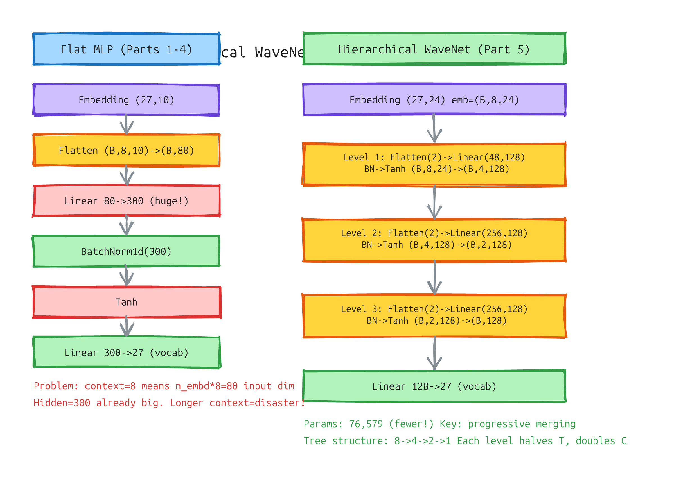
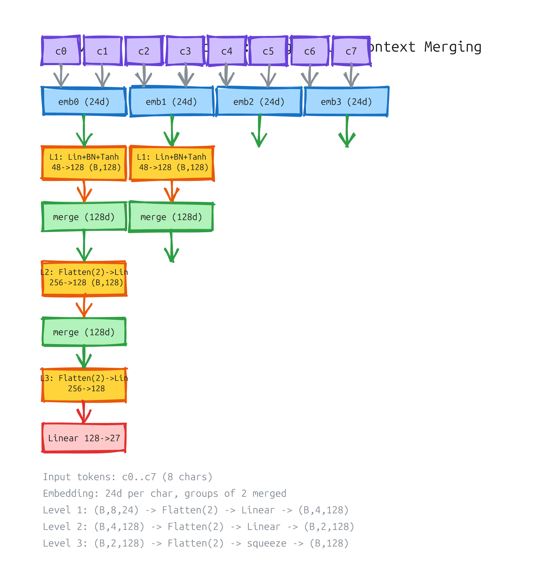

# Makemore 完结篇：从 MLP 到 WaveNet，理解语言建模的每一步

> 资料源：Andrej Karpathy "Building makemore" 系列
> Part 1-4: https://www.youtube.com/watch?v=q8SA3rM6ckI (P4 Backprop Ninja)
> Part 5: https://www.youtube.com/watch?v=t3YJ5hKiMQ0 (Building a WaveNet)
> Notebook: https://github.com/karpathy/nn-zero-to-hero

makemore 系列五章，从最简单的 Bigram 统计模型一步步演进到 WaveNet 风格的层次化架构。这篇文章不是逐视频复述，而是**纵向梳理每一层为什么存在、做什么、怎么工作**——让你看完后对整个 MLP + 语言建模的全流程有系统性的理解。

---

## 全景回顾：五章分别讲了什么

| Part | 主题 | 核心贡献 |
|------|------|---------|
| P1 | Bigram 语言模型 | 最简单的"看前一个字符预测下一个"，矩阵统计 |
| P2 | MLP 语言模型 | Bengio 2003 架构：嵌入 + 线性层 + 交叉熵 |
| P3 | 激活函数与 BatchNorm | 为什么需要 Tanh、初始化技巧、BN 的作用 |
| P4 | Backprop Ninja | 手动反向传播，理解梯度流动 |
| P5 | WaveNet | 层次化架构：用树状结构处理长上下文 |

---

## 每一层的角色（纵向总结）

从输入到输出，按数据流顺序：

### 1. 嵌入层（Embedding）

**做什么**：把离散的字符索引（0-26）映射为连续向量。

**为什么需要**：字符本身是 categorical 变量，没有数值意义。嵌入层学习每个字符的"语义向量"——相似字符的向量在空间中靠近。

**怎么工作**：`C` 是一个 `(vocab_size, n_embd)` 的矩阵。`C[Xb]` 查表取出对应行。

```python
emb = C[Xb]  # (32, 8, 24)  — batch=32, 8个字符, 每字符24维
```

**关键直觉**：嵌入层等价于一个 one-hot → Linear 映射，但更高效。每个字符学到一个分布式的特征表示。

### 2. Flatten / 拼接

**做什么**：把 (B, T, C) 的张量展平成 (B, T\*C) 或 (B, T/n, C\*n)。

**为什么需要**：线性层要求输入是 2D 的 (batch, features)。需要把时间维和特征维合并。

**两种策略**：
- **Flat MLP**: 把所有 8 个字符拼成一个长向量 → `(B, 8*24) = (B, 192)`
- **Hierarchical**: 每次合并 2 个 → `(B, 4, 48)` → `(B, 2, 96)` → `(B, 192)`

```python
# FlattenConsecutive(n): 把相邻 n 个在时间维合并
# (B, T, C) → (B, T//n, C*n)
def __call__(self, x):
    B, T, C = x.shape
    x = x.view(B, T//self.n, C*self.n)
    if x.shape[1] == 1:
        x = x.squeeze(1)  # 最后一个时间维也被合并，变成 2D
    return x
```

### 3. 线性层（Linear）

**做什么**：`y = x @ W + b`，仿射变换。

**为什么需要**：神经网络的"学习"主要发生在这里。线性层通过调整权重矩阵，提取特征的不同组合。

**怎么工作**：

```python
class Linear:
    def __init__(self, fan_in, fan_out):
        self.weight = torch.randn(fan_in, fan_out) / fan_in**0.5  # Kaiming init
        self.bias = torch.zeros(fan_out)

    def __call__(self, x):
        self.out = x @ self.weight
        if self.bias is not None:
            self.out += self.bias
        return self.out
```

**关键直觉**：线性层的每一列是一个"检测器"——它学习在输入中寻找某种模式。多列组合起来形成特征空间。

**规模问题**：Flat MLP 中，上下文越长，线性层输入维越大。context=8, n_embd=10 时输入是 80 维；context=8, n_embd=24 时输入是 192 维。hidden_size 需要相应增长，参数规模爆炸。

### 4. BatchNorm 层

**做什么**：对每个特征列做标准化：减去均值、除以标准差 → 缩放平移。

**为什么需要**：三个原因：
1. **控制激活值的分布**——防止 Tanh 层的输入落入饱和区（梯度消失）
2. **允许更高的学习率**——标准化后梯度更稳定
3. **减少对初始化的敏感度**——不管前一层的输出怎么变，BN 都把它归一化到标准分布

**怎么工作**（训练模式）：

```python
xmean = x.mean(dim=(0,1), keepdim=True)   # 跨 batch + 时间维求均值
xvar = x.var(dim=(0,1), keepdim=True)     # 跨 batch + 时间维求方差
xhat = (x - xmean) / (xvar + eps).sqrt()  # 标准化
out = gamma * xhat + beta                  # 缩放平移
```

**对 3D 张量的处理**：当 `x` 是 `(B, T, C)` 时，BN 需要在 `(0, 1)` 维上求统计量（batch + 时间），而不是只对 batch。这是 WaveNet 的关键适配——时间维的每个位置共享同样的 BN 参数。

```python
if x.ndim == 2:
    dim = 0              # (B, C) — 对 batch 求统计量
elif x.ndim == 3:
    dim = (0, 1)         # (B, T, C) — 对 batch + 时间求统计量
```

### 5. Tanh 激活函数

**做什么**：引入非线性。`tanh(x) = (e^x - e^{-x}) / (e^x + e^{-x})`，输出范围 (-1, 1)。

**为什么需要**：没有激活函数的线性层堆叠等价于一个线性层。非线性是神经网络表达能力的来源。

**为什么是 Tanh 而不是 ReLU**：Tanh 是中心对称的（zero-centered），输出在 BN 之后分布更稳定。ReLU 虽然更常见（CV 领域），但在小规模语言模型中 Tanh 效果更好。

**梯度消失问题**：Tanh 的导数 = `1 - tanh(x)²`。当 x 很大时，tanh(x) ≈ ±1，导数 ≈ 0 → 梯度消失。BN 的存在就是为了防止这种情况。

### 6. Softmax + Cross-Entropy Loss

**做什么**：Softmax 把 logits 转成概率分布。Cross-Entropy 衡量预测分布和真实分布的差异。

**简化的梯度形式**（来自 P4 的推导）：

```python
dlogits = F.softmax(logits, 1)       # 预测概率
dlogits[range(n), Yb] -= 1           # 正确类别减 1
dlogits /= n                          # 除以 batch 大小
```

---

## Flat MLP 的问题：上下文越长，参数越多

回顾 Part 2-4 的网络结构：

```
Embedding(27,10) → Flatten(8) → Linear(80,300) → BN → Tanh → Linear(300,27)
```

当 context=3 时，Linear 输入是 `10*3=30` 维，没问题。

当 context=8 时，Linear 输入是 `10*8=80` 维。如果 n_embd 更大（比如 24），那就是 `24*8=192` 维。

**线性层的参数量 = fan_in * fan_out**。输入维每增加一倍，参数量也翻倍。更长的上下文需要更大的网络——这是 Flat MLP 的致命伤。

---

## Part 5 的解法：WaveNet 层次化架构

WaveNet（原用于音频生成）的核心思想：**不用一层处理所有上下文，而是逐级合并。**

### 架构对比

下图对比了 Flat MLP 和 Hierarchical WaveNet 的结构：



两个架构最终都输出 `(B, 27)` 给 softmax，但中间结构完全不同。

### 树状合并过程

层次化架构的核心是 **FlattenConsecutive**——每次合并相邻两个时间步：



```
初始:  (B, 8, 24)    — 8 个字符，各 24 维
L1:    (B, 4, 128)   — Flatten(2): 4 组，每组 48→128 维
L2:    (B, 2, 128)   — Flatten(2): 2 组，每组 256→128 维
L3:    (B, 128)      — Flatten(2) + squeeze: 1 组，256→128 维 → 拍平
输出:  (B, 27)       — Linear 128→27
```

**关键直觉**：每一层看到的"视野"变大了，但通道数也变大了。底层负责局部模式（两个字符的组合），顶层负责全局模式（整个 8 字符上下文）。

### 参数效率对比

| 架构 | 参数量 | 上下文 | 嵌入维 |
|------|--------|--------|--------|
| Flat MLP | ~100K+ | 8 | 10 |
| Hierarchical | **76,579** | 8 | 24 |

层次化架构的嵌入维更大（24 vs 10），但总参数量反而更少。这就是渐进合并的威力。

### 实现代码

```python
n_embd = 24
n_hidden = 128

model = Sequential([
    Embedding(vocab_size, n_embd),                    # (B,8,24)
    FlattenConsecutive(2), Linear(48, n_hidden, bias=False), BatchNorm1d(n_hidden), Tanh(),  # (B,4,128)
    FlattenConsecutive(2), Linear(256, n_hidden, bias=False), BatchNorm1d(n_hidden), Tanh(), # (B,2,128)
    FlattenConsecutive(2), Linear(256, n_hidden, bias=False), BatchNorm1d(n_hidden), Tanh(), # (B,128)
    Linear(n_hidden, vocab_size),                               # (B,27)
])
```

注意最后输出层需要做特殊初始化：`model.layers[-1].weight *= 0.1`，让初始预测更均匀（不自信），防止训练早期 loss 爆炸。

---

## 训练过程

训练代码和之前完全一样——SGD + 学习率衰减：

```python
max_steps = 200000
batch_size = 32

for i in range(max_steps):
    ix = torch.randint(0, Xtr.shape[0], (batch_size,))
    Xb, Yb = Xtr[ix], Ytr[ix]

    logits = model(Xb)
    loss = F.cross_entropy(logits, Yb)

    for p in parameters:
        p.grad = None
    loss.backward()

    lr = 0.1 if i < 150000 else 0.01  # step decay
    for p in parameters:
        p.data += -lr * p.grad
```

**学习率衰减**为什么需要？后期 loss 进入平稳区，小学习率有助于精细调整。

---

## 逐形状解读：每一层对 (B, T, C) 做了什么

理解层次化架构的关键是看懂每一层对张量形状 `(B, T, C)` 的变换。

完整形状变化链（以 batch=4, context=8, n_embd=10, n_hidden=200 为例）：

```
Embedding             → (4, 8, 10)      4样本，8字符，每字符10维
FlattenConsecutive(2) → (4, 4, 20)      相邻2字符合并→4组，每组20维
Linear(20→200)        → (4, 4, 200)     每组特征从20扩到200
BatchNorm1d           → (4, 4, 200)     标准化数值分布
Tanh                  → (4, 4, 200)     非线性

FlattenConsecutive(2) → (4, 2, 400)     相邻2组合并→2组，每组400维
Linear(400→200)       → (4, 2, 200)     每组特征从400压缩到200
BatchNorm1d           → (4, 2, 200)     标准化
Tanh                  → (4, 2, 200)     非线性

FlattenConsecutive(2) → (4, 400)        squeeze掉时间维
Linear(400→200)       → (4, 200)        压缩到200维
BatchNorm1d           → (4, 200)        标准化
Tanh                  → (4, 200)        非线性

Linear(200→27)        → (4, 27)         输出：每个样本对27字符打分
```

### 三个维度的含义

| 维度 | 记作 | 含义 |
|------|------|------|
| 第1维 | B (batch) | 一次处理几个样本 |
| 第2维 | T (time/token) | 字符位置数，逐步减少 |
| 第3维 | C (channel/feature) | 每个位置的信息"宽度" |

### 每个操作的规律

**FlattenConsecutive(n)**: `(B, T, C) → (B, T/n, C×n)`
- 时间步 T 除以 n，特征 C 乘以 n
- 信息重新排列但没有压缩
- 最终当 T=1 时 squeeze 掉时间维，变成 2D

**Linear**: `(B, T, C_in) → (B, T, C_out)`
- 对每个时间步独立做 `x @ W + b`
- 时间步 T 不变
- C_in → C_out 可以是升维（扩展信息）或降维（压缩信息）
- 所有时间步共享同一个权重矩阵 W

**BatchNorm1d**: `(B, T, C) → (B, T, C)` 形状不变
- 跨 batch 和时间的维度求统计量
- 把数值拉回到均值为0、方差为1的分布
- 用可学习的 γ 和 β 恢复表达能力

**Tanh**: 形状不变，数值被夹到 (-1, 1)

### 树状合并的直觉

把 8 个字符逐步合并到 1 个向量的过程：

```
c0 c1 c2 c3 c4 c5 c6 c7          ← 8个字符位置
  └─┘  └─┘  └─┘  └─┘
  组0   组1   组2   组3            ← T=4, C翻倍
  └─────┘     └─────┘
     组0          组1             ← T=2, C再翻倍
     └──────────────┘
            组0                   ← T=1, squeeze成2D
```

每一层看到的范围更大、信息更丰富，但空间更小。

---

## Flat MLP vs Hierarchical：深层理解

| 维度 | Flat MLP | Hierarchical (WaveNet) |
|------|---------|----------------------|
| 特征提取 | 一层提取所有上下文特征 | 逐层提取，底层局部→顶层全局 |
| 参数效率 | 差（输入维 × hidden 大） | 好（逐级合并，共享参数模式） |
| 数学本质 | 全连接：每个输入特征有权重 | 卷积式：每个时间步共享权重 |
| 扩展性 | 上下文增 → 参数暴增 | 上下文增 → 增加层级即可 |
| 信息流 | 所有位置直接连接输出 | 树状：相邻位置先合并，逐级向上 |

**Flat MLP 本质是"长程全连接"**——8 个位置的 80 个输入全部连接到 300 个隐藏神经元。这给模型很大的表达能力，但参数效率低。

**Hierarchical 本质是"局部→全局"的渐进抽象**——底层只看到 2 个字符的局部组合，顶层看到完整的 8 字符上下文。这和人处理语言的方式更接近：先理解词的形态，再理解短语，最后理解句子。

---

## 总结：语言建模中每一层的存在理由

| 层 | 存在理由（一句话） |
|----|------------------|
| Embedding | 把离散符号变成连续语义空间 |
| Flatten / FlattenConsecutive | 把时间结构变成特征结构，供线性层处理 |
| Linear | 学习特征之间的加权组合 |
| BatchNorm | 防止激活值失控，稳定训练 |
| Tanh | 引入非线性 + 中心对称分布 |
| Softmax + CE | 把分数转换成概率 + 衡量预测质量 |

**五章系列的核心演进逻辑**：

1. 从统计（Bigram）到学习（MLP）
2. 从手动（梯度）到自动（autograd）再回到手动（Backprop Ninja）
3. 从平面（Flat）到层次（WaveNet）

每解决一个问题，下一个问题就浮现出来——这正是深度学习最迷人的地方。
